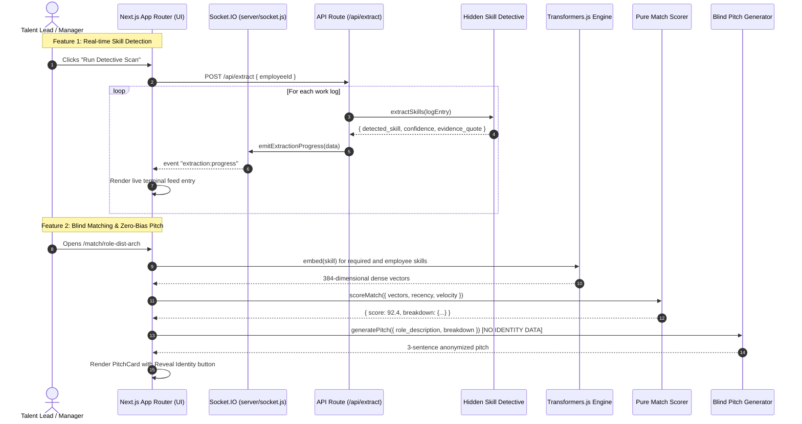

# TalentLens Architecture Specification

> **Platform:** TalentLens MVP  
> **Engineering Team:** 4D Developers  
> **Document Scope:** AI Layer Separation, Pure Function Mathematical Scoring, and End-to-End Telemetry Flows

---

## 1. The AI Engine Split: Own AI Engine vs. Generative Layer

TalentLens enforces a strict architectural boundary between **deterministic semantic representation** and **generative language synthesis**. This prevents LLM hallucination in candidate evaluation and guarantees audited zero-bias operations.

```
┌──────────────────────────────────────────────────────────────────────────────┐
│                            TALENTLENS AI TOPOLOGY                            │
├──────────────────────────────────────┬───────────────────────────────────────┤
│        OWN AI ENGINE (LOCAL)         │        GENERATIVE LAYER (LLM)         │
├──────────────────────────────────────┼───────────────────────────────────────┤
│ • Library: @xenova/transformers      │ • SDK: @anthropic-ai/sdk              │
│ • Model: Xenova/all-MiniLM-L6-v2     │ • Model: claude-sonnet-4-6            │
│ • Execution: Local Node.js process   │ • Execution: API boundary (structured)│
│ • Purpose: Dense vector embeddings   │ • Purpose: Natural language synthesis │
│ • Dimensionality: 384 dimensions     │ • Format: Strict JSON & 3-sentence text│
│ • External Key: NONE (Zero API cost) │ • Fallback: Autonomous local synthesis│
└──────────────────────────────────────┴───────────────────────────────────────┘
```

### 1.1 Why This Split Matters
1. **Mathematical Reproducibility**: Skill embeddings and similarity calculations are computed locally via `all-MiniLM-L6-v2`. Given the exact same text, the mathematical output is identical every single time.
2. **Privacy & Security**: Raw vector embeddings and internal candidate capability matrices are calculated in-memory on the local server without shipping employee database records to third-party endpoints.
3. **Targeted Generative Boundary**: The generative model (`claude-sonnet-4-6`) is restricted solely to language tasks:
   - Extracting structured JSON from unstructured work logs (`extract-skills.js`).
   - Formatting career progression milestone copy (`generate-roadmap.js`).
   - Synthesizing 3-sentence anonymized executive pitches grounded in telemetry data (`generate-pitch.js`).

---

## 2. The Pure Mathematical Scoring Formula

Candidate matching in TalentLens is intentionally implemented as a **pure function with zero LLM inference**. This guarantees complete auditability and eliminates algorithmic bias.

### 2.1 The Formula

$$\text{Score} = 0.4 \times S_{\text{explicit}} + 0.3 \times S_{\text{transferable}} + 0.2 \times S_{\text{recency}} + 0.1 \times S_{\text{velocity}}$$

Where:

$$\begin{aligned}
S_{\text{explicit}} &\in [0, 1] \quad \text{Direct cosine similarity between candidate explicit skills and role requirements} \\
S_{\text{transferable}} &\in [0, 1] \quad \text{Cosine similarity between AI-inferred latent skills and role requirements} \\
S_{\text{recency}} &\in [0, 1] \quad \text{Decay factor based on recent production log frequency and activity} \\
S_{\text{velocity}} &\in [0, 1] \quad \text{Telemetry-measured rate of new skill acquisition and mastery}
\end{aligned}$$

### 2.2 Component Breakdown & Rationale

| Weight | Parameter | Rationale |
|---|---|---|
| **40%** (`0.4`) | **Explicit Match** | Anchors baseline technical qualification against core mandatory prerequisites. |
| **30%** (`0.3`) | **Transferable Match** | Rewards latent production capabilities discovered by the Hidden Skill Detective, identifying versatile cross-domain talent. |
| **20%** (`0.2`) | **Recency Score** | Prioritizes engineers actively engaged in modern systems engineering over stale legacy experience. |
| **10%** (`0.1`) | **Learning Velocity** | Signals adaptive capacity, rapid ramp-up potential, and agility in shifting technology landscapes. |

### 2.3 Pure Function Contract (`lib/ai/score-match.js`)
```javascript
/**
 * PURE FUNCTION: Calculates a match score between an employee and a role using a pure mathematical weighted formula without LLM calls.
 * @param {Object} params - Input scoring parameters.
 * @param {Array<number[]>|{explicit?: Array<number[]>, inferred?: Array<number[]>}} params.employeeSkillVectors
 * @param {Array<number[]>} params.roleSkillVectors
 * @param {number} [params.recencyScore=0.8]
 * @param {number} [params.learningVelocity=0.8]
 * @returns {{score: number, breakdown: Object}}
 */
export function scoreMatch({ ... })
```

---

## 3. End-to-End Telemetry & Data Flow



---

## 4. Realtime Streaming Architecture (`server/`)

To support instantaneous streaming of inferred skills without polling latency, TalentLens mounts a bidirectional Socket.IO layer directly onto the Express HTTP server in `server/index.js`:

1. `server/socket.js` instantiates the Socket.IO server with CORS safeguards.
2. During work log processing, `emitExtractionProgress()` broadcasts telemetry updates containing:
   - `employeeId`
   - `logIndex` and `totalLogs`
   - `detected_skill`
   - `confidence` (0.70 to 0.99)
   - `evidence_quote`
   - `category`
3. `components/LiveExtractionFeed.jsx` connects via `socket.io-client` and renders a live, terminal-styled log feed with auto-scrolling and real-time progress bars.

---

## 5. Directory Structure & Separation of Concerns

```
talentlens/
├── README.md                           ← Core project specification & mapping table
├── ARCHITECTURE.md                     ← Deep-dive technical architecture (this file)
├── .env.example                        ← Environment template
├── package.json                        ← Dependencies & build scripts
├── next.config.js                      ← Native module resolution config
├── tailwind.config.js                  ← Dark editorial design tokens
├── server/
│   ├── index.js                        ← Express + Socket.IO bootstrap
│   └── socket.js                       ← extraction:progress event emitter
├── lib/
│   └── ai/
│       ├── embeddings.js               ← OWN AI ENGINE (Transformers.js all-MiniLM-L6-v2)
│       ├── score-match.js              ← Scoring algorithm (PURE FUNCTION, no LLM)
│       ├── extract-skills.js           ← Hidden Skill Detective prompt & schema
│       ├── generate-roadmap.js         ← Career GPS roadmap generator
│       └── generate-pitch.js           ← Blind Matching anonymized pitch prompt
├── data/
│   ├── employees.json                  ← Realistic sample employee profiles & work logs
│   └── roles.json                      ← Realistic engineering target role requirements
├── app/
│   ├── layout.jsx                      ← Root layout with dark editorial styling
│   ├── globals.css                     ← CSS variables and animations
│   ├── page.jsx                        ← Dashboard view
│   ├── employee/[id]/page.jsx          ← Profile view with LiveExtractionFeed
│   ├── roadmap/[employeeId]/[roleId]/page.jsx ← SkillTree view
│   ├── match/[roleId]/page.jsx         ← Blind Matching PitchCard grid
│   └── api/
│       ├── extract/route.js            ← Ingest logs & dispatch realtime events
│       ├── roadmap/route.js            ← Dynamic career tree calculation
│       └── pitch/route.js              ← Candidate blind scoring & pitch synthesis
├── components/
│   ├── Navbar.jsx                      ← Global header with engine status pill
│   ├── Dashboard.jsx                   ← Metric cards & talent directory table
│   ├── LiveExtractionFeed.jsx          ← Realtime terminal feed
│   ├── SkillTree.jsx                   ← Native SVG-connected directed graph
│   └── PitchCard.jsx                   ← Anonymized candidate pitch with reveal toggle
└── tests/
    ├── score-match.test.js             ← Pure formula mathematical unit tests
    └── embeddings.test.js              ← Vector normalization & similarity tests
```
